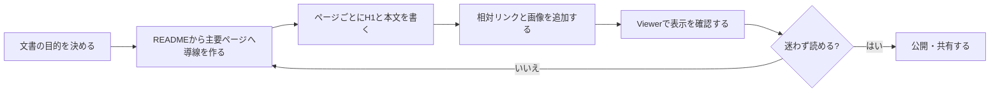
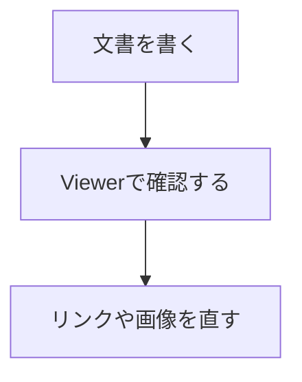

# ドキュメント作成ガイド

このガイドは、Markdown Viewer で読みやすい Project 文書を作成する人向けの指針です。

## 基本方針

Viewer は、選択したフォルダを 1 つの Project として扱います。

Project の入口には `README.md` を置くことを推奨します。`README.md` の最初の `# 見出し` は Viewer のタイトルやブラウザタブ名に使われます。

## 作成と確認の流れ



## 推奨フォルダ構成

小さな Project では、ルート直下に Markdown を並べるだけで十分です。

```text
project-docs/
  README.md
  overview.md
  setup.md
  faq.md
```

文書が増える場合は、読み手の目的ごとにフォルダを分けます。

```text
project-docs/
  README.md
  user-guide/
    getting-started.md
    operations.md
  development/
    requirements.md
    specification.md
    todo.md
  assets/
    screen-main.png
```

`.project-docs` や `.docs` のようなドット始まりのフォルダも、Viewer のルートとして選択できます。

ただし、選択ルートの配下にあるドット始まりのファイルやフォルダはインデックス対象外です。Viewer で見せたい文書は、ルート配下の通常名フォルダに置いてください。

## ファイル名

ファイル名は、リンクしやすく、URL に入っても読みやすい名前を推奨します。

- 英数字とハイフンを中心にする
- 1 ファイル 1 テーマにする
- 長すぎる名前を避ける
- 同じ階層で似すぎた名前を避ける

日本語ファイル名も利用できますが、相対リンクやブックマークを扱う場合は英語名のほうが安定します。

## 表示順を制御するPrefix

フォルダ名の先頭に数字と `_` または `-` を付けると、ツリー上の表示名ではそのPrefixが除外されます。

```text
01_user-guide/
02_development/
10_reference/
```

Viewer 上では次のように表示されます。

```text
user guide
development
reference
```

フォルダの並び順を制御しつつ、読み手には番号を見せたくない場合に使います。

## 見出し

各ページは 1 つの `# 見出し` から始めることを推奨します。

```markdown
# 使い方ガイド

このページでは...
```

Viewer はページ一覧の表示名として、Markdown 内の最初の `# 見出し` を優先します。見出しがない場合はファイルパスからタイトルを作ります。

読み手が迷わないように、`##` 以降の見出しはページ内の流れに沿って並べてください。

## 対応している Markdown

Viewer は次の基本記法に対応しています。

- 見出し
- 段落
- 箇条書き、番号付きリスト、ネストしたリスト
- タスクリスト
- 引用
- コードブロック
- 表
- 水平線
- 太字
- インラインコード
- Markdown リンク
- Markdown 画像
- Mermaid コードブロック

Markdown パーサーは軽量な独自実装です。CommonMark や GitHub Flavored Markdown の完全互換ではありません。

## リンク

Project 内の Markdown へのリンクは、相対パスで書きます。

```markdown
[仕様](development/specification.md)
[セットアップ](user-guide/getting-started.md)
```

同じフォルダ内の文書へはファイル名だけでリンクできます。

```markdown
[FAQ](faq.md)
```

見出しへ直接リンクしたい場合は、ハッシュを付けます。

```markdown
[検索の使い方](01_viewer-user-guide.md#検索する)
```

外部リンクは通常の URL で書きます。

```markdown
[Mermaid](https://mermaid.js.org/)
```

## 画像

画像は Markdown ファイルから見た相対パスで指定します。

```markdown

```

文書と画像の距離が遠くなりすぎるとリンク切れに気づきにくくなります。ページ群ごとに `assets` フォルダを置くか、Project 共通の `assets` フォルダにまとめる運用を決めてください。

## Mermaid 図

Mermaid 図は、言語名 `mermaid` のコードブロックとして書きます。



図が描画されない場合は、Mermaid の構文エラーがないか確認してください。

## 表

表は一般的な Markdown テーブルで書けます。

```markdown
| 項目 | 説明 |
| --- | --- |
| README.md | Project の入口 |
| assets/ | 画像置き場 |
```

横に長い表は読みづらくなるため、列数を抑えるか、複数の表に分けてください。

## 検索されやすい文書にする

Viewer の検索は、ページタイトル、パス、本文を対象にします。

重要なキーワードは画像だけに入れず、本文にも書いてください。略語を使う場合は、初出で正式名称も併記すると検索しやすくなります。

## 避けたい書き方

- 1 ページに複数の主題を詰め込みすぎる
- 見出しだけで本文がほとんどない
- 画像だけで手順を説明する
- リンク先のない「詳細はこちら」を多用する
- 深すぎるフォルダ階層に文書を置く

## 公開前チェック

- `README.md` から主要ページへ移動できる
- 各ページに分かりやすい `# 見出し` がある
- 相対リンクが Viewer 内で開ける
- 画像が表示される
- Mermaid 図が描画される
- 検索したい語句が本文に含まれている
