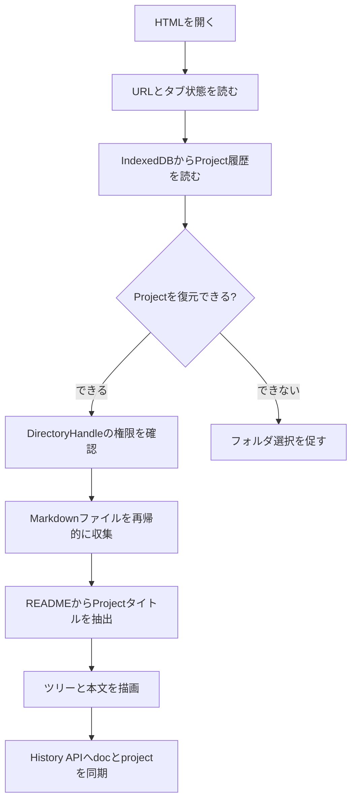

# 仕様

この文書は、AI や開発者が Markdown Viewer を変更するときに参照する実装仕様です。

## アプリ構成

アプリは静的ファイルのみで構成する。

- `MD-Viewer.html`: DOM 構造とスクリプト読み込み
- `src/main.css`: 画面レイアウト、テーマ、Markdown 表示スタイル
- `src/main.js`: アプリロジック
- `src/mermaid.min.js`: Mermaid ランタイム
- `.docs/`: この Viewer 自体のドキュメント

## 主な機能

- ローカル Markdown フォルダの選択と閲覧
- 過去に開いた Project の履歴管理
- タブごとに異なる Project を保持する表示状態
- README の先頭見出しをアプリタイトルとして表示
- フォルダ名とページ数のサブタイトル表示
- Markdown ファイルのツリー表示、展開、折りたたみ
- ページ名、パス、本文を対象にした簡易検索
- Markdown 内リンク、画像、Mermaid 図の表示
- ルートフォルダ名付き相対パスのコピー
- 外部エディタで現在ページを開く URL scheme 連携
- ライトテーマ、ダークテーマ切り替え
- サイドバー幅の保存

ビルド工程はない。JavaScript はブラウザで直接実行される。

## 表示までの流れ



## 状態管理

`src/main.js` 内で状態を保持する。

- `docs`: 検出済み Markdown の配列
- `activePath`: 現在表示中の Markdown パス
- `openFolders`: ツリーで展開中のフォルダ
- `rootDirectoryHandle`: 選択中 Project の DirectoryHandle
- `rootDisplayName`: 選択フォルダ名
- `rootReadmeTitle`: `README.md` から抽出した Project タイトル
- `activeProjectId`: 選択中 Project の履歴 ID
- `projectHistory`: Project 履歴

Project 履歴の各項目には、File System Access API の `handle` に加えて、外部エディタ連携用の `editorRootPaths` を保存できる。

`editorRootPaths` はエディタ ID ごとのローカル絶対Pathを持つ。

```json
{
  "vscode": "D:/Projects/Example/.docs",
  "cursor": "/Users/you/projects/example/.docs"
}
```

選択中エディタに対応する `editorRootPaths` がある場合、ヘッダーのサブタイトルと Project一覧のメタ情報ではフォルダ名ではなく、その絶対Pathを表示する。

## Storage

`localStorage` は全タブで共有してよい設定に使う。

- `markdownDocsPreview.openFolders`: ツリー展開状態
- `markdownDocsPreview.sidebarWidth`: サイドバー幅
- `markdownDocsPreview.theme`: テーマ
- `markdownDocsPreview.editorProduct`: 選択中の外部エディタ

`sessionStorage` はタブごとに分ける必要がある状態に使う。

- `markdownDocsPreview.activeProjectId`: 現在タブの Project
- `markdownDocsPreview.activePath`: 現在タブのページ

URL には現在ページと Project ID を反映する。

- `doc`: 現在ページ
- `project`: Project 履歴内の ID

初回表示時の Project 復元は、URL の `project`、`sessionStorage`、旧 `localStorage`、履歴先頭の順に試す。

Project 履歴は IndexedDB に保存する。

- DB 名: `markdownDocsPreview`
- store 名: `handles`
- key: `projects`

履歴には File System Access API の handle を含める。

## Project 選択

`chooseMarkdownFolder()` は `window.showDirectoryPicker()` を呼び、読み取り権限を確認する。

既存履歴に同じ handle がある場合は、その Project ID を再利用する。新規フォルダの場合は `crypto.randomUUID()` またはフォールバック ID を使う。

Project 名は `README.md` の先頭 `#` 見出しを優先する。サブタイトル表示用のフォルダ名は `handle.name` を保持する。

File System Access API では、ユーザーが入力した任意の絶対Path文字列を `showDirectoryPicker()` の初期フォルダとして指定できない。フォルダ選択の初期位置に使えるのは、対応ブラウザが認める既知フォルダ、またはすでに取得済みの `FileSystemHandle` に限られる。

## Markdown インデックス

`indexDirectoryMarkdownFiles()` は DirectoryHandle を再帰的に走査する。

選択されたルートフォルダ自体は、`.docs` や `.project-docs` のようなドット始まりでも利用できる。除外対象は、ルート配下を走査するときに見つかったドット始まりの項目である。

対象条件:

- 拡張子が `.md`
- 名前が `Preview.html` ではない
- ルート配下のファイル名またはフォルダ名が `.` で始まらない

取得パスは `/` 区切りに正規化し、重複を除去する。

## タイトル抽出

`extractTitleFromMarkdown()` は Markdown 内の最初の `# 見出し` をタイトルとして抽出する。

インラインコード、太字、Markdown リンクの装飾は簡易的に除去する。

## Markdown レンダリング

`renderMarkdown()` は独自の軽量 Markdown レンダラーである。

対応する主なブロック:

- 見出し
- コードブロック
- Mermaid コードブロック
- 水平線
- 引用
- リスト
- タスクリスト
- 表
- 段落

対応する主なインライン:

- インラインコード
- 画像
- リンク
- 太字

HTML は基本的に `escapeHtml()` を通して出力する。Markdown 由来の HTML をそのまま実行する仕様にはしない。

## リンク解決

Markdown 内の相対 `.md` リンクは `resolveDocLink()` で現在ページからの相対パスとして解決し、Viewer 内の `loadDoc()` に差し替える。

HTTP、HTTPS、mailto、ページ内アンカーのみのリンクは通常リンクとして扱う。

ハッシュは History API の URL に反映し、表示後に対象見出しへスクロールする。

## 画像解決

Markdown 画像は `data-image-src` として一度描画し、`resolveRenderedImages()` で実画像に差し替える。

相対パス画像は現在ページからの相対パスとして解決し、FileHandle から `Blob URL` を作る。ページ遷移時には既存の Object URL を破棄する。

## Mermaid

言語名が `mermaid` のコードブロックは `<div class="mermaid">` として出力する。

`renderMermaidDiagrams()` は `window.mermaid.initialize()` と `window.mermaid.run()` を呼ぶ。テーマは現在の Viewer テーマに合わせる。

テーマ切り替え時、表示中ページに Mermaid 図が含まれている場合は現在ページを再読み込みし、Mermaid を現在テーマで再描画する。

## 外部エディタ連携

外部エディタ連携は、File System Access API で取得した `DirectoryHandle` から絶対Pathを得るのではなく、ユーザーが初回入力したドキュメントルートの絶対Pathを使う。

選択エディタは `localStorage` の `markdownDocsPreview.editorProduct` に保存し、全タブで共有する。別タブの変更は `storage` イベントで反映する。

対応エディタ:

- VS Code: `vscode://file/...`
- Cursor: `cursor://file/...`
- Windsurf: `windsurf://file/...`

`開く` ボタン押下時の流れ:

1. 現在ページが Project 内の Markdown であることを確認する。
2. Project 履歴から選択エディタ用の `editorRootPaths[editorId]` を探す。
3. 未登録なら、ドキュメントルートの絶対Path入力を促す。
4. 入力Pathが現在ページのファイルPathまで含む場合は、現在ページの相対Pathを末尾から取り除いてルートPathに補正する。
5. ルートPathと現在ページの相対Pathを結合し、エディタ別 URL scheme を生成して開く。

この機能は URL scheme が OS に登録されていることを前提にする。

外部エディタ用の絶対Pathは、フォルダ選択権限の取得には使わない。Markdown の閲覧は引き続き File System Access API の `DirectoryHandle` を使う。

## History

ページ遷移は History API に同期する。

URL クエリ:

- `doc`: 現在ページ
- `project`: Project 履歴内の ID

URL ハッシュ:

- 見出しアンカー

初回表示時は URL、`sessionStorage`、旧 `localStorage`、`README.md` の順に現在ページを決める。

## 変更時の注意

- タブごとに保持すべき状態を `localStorage` に戻さない。
- File System Access API の handle は IndexedDB に保存する。
- 外部エディタ用の絶対Pathは Project 履歴内の `editorRootPaths` に保存する。
- `.docs` などドット始まりのフォルダをルートとして選択できる挙動を保つ。
- ルート配下のドット始まり項目は、意図せず隠しファイルを拾わないようインデックス対象外のままにする。
- Markdown レンダラーを拡張する場合は、必ず HTML エスケープの経路を確認する。
- 既存の単一ファイル運用を壊す依存追加は避ける。
