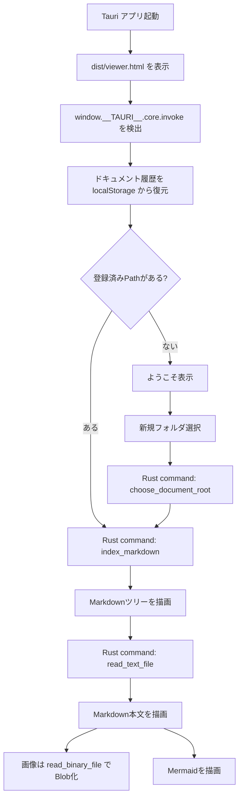

# 仕様

この文書は、AI や開発者が Markdown Viewer を変更するときに参照する実装仕様です。

## アーキテクチャ

通常運用は Tauri アプリ版です。既存の HTML/CSS/JavaScript UI を維持し、ローカルファイルアクセスだけを Rust command に委譲します。



## 主なファイル

- `viewer.html`: DOM 構造とスクリプト読み込み。
- `src/main.css`: 画面レイアウト、テーマ、Markdown 表示スタイル。
- `src/main.js`: Viewer の状態管理、Markdown レンダリング、Tauri/FSA の分岐。
- `src/mermaid.min.js`: Mermaid ランタイム。
- `src-tauri/`: Tauri アプリ本体。
- `src-tauri/src/lib.rs`: ローカルファイルアクセス用 Rust command。
- `tools/prepare-tauri-assets.mjs`: Tauri が読む静的アセットを `dist/` にコピーするスクリプト。
- `docs/`: Viewer 自体のドキュメント。

## Tauri command

`src-tauri/src/lib.rs` に次の command を定義する。

- `choose_document_root() -> Option<String>`
  - OS 標準のフォルダ選択 UI を開き、選択されたフォルダの絶対Pathを返す。
- `index_markdown(root) -> { rootPath, folderName, paths }`
  - ドキュメントルートを検証し、配下の Markdown Path 一覧を返す。
- `read_text_file(root, path) -> String`
  - ドキュメントルート配下のテキストファイルを読む。
- `read_binary_file(root, path) -> ArrayBuffer`
  - ドキュメントルート配下の画像などを読む。
- `open_file(root, path)`
  - ドキュメントルート配下のファイルを OS の関連付けアプリで開く。

すべてのファイル読み取り command は、`root` と相対 `path` を結合したあと canonicalize し、結果が `root` 配下に収まることを確認する。

## 実行モード

`src/main.js` は次の順に実行モードを判定する。

- `window.__TAURI__?.core?.invoke` があれば Tauri 版。
- なければ File System Access API 対応ブラウザでのフォールバック。
- どちらも使えない場合はドキュメント登録 UI を無効化する。

## ウィンドウ状態

Tauri 版は `tauri-plugin-window-state` で、アプリ終了時のウィンドウサイズと表示位置を保存し、次回起動時に復元する。

Windows のリリースビルドでは `windows_subsystem = "windows"` を指定し、Viewerとは別のコンソールWindowを表示しない。

## ビルドと配布

開発環境から起動する場合は、Node.js と Rust/Cargo を用意したうえで次を実行する。

```powershell
npm.cmd install
npm.cmd run tauri:dev
```

配布用EXEを作成する場合は、次を実行する。

```powershell
npm.cmd run tauri:build
```

Windows 向けの配布物は `src-tauri/target/release/md-viewer.exe` 単体とする。

`src-tauri/tauri.conf.json` の `bundle.active` は `false` にしており、MSI や setup.exe は生成しない。

チーム内配布では、当面はコード署名なしで運用する。SmartScreen や組織ポリシーで問題が出る場合は、証明書による署名を別途検討する。

アイコン画像を差し替えた場合にリソース再生成が走るよう、`src-tauri/build.rs` で `icons/icon.ico` と `icons/icon.png` を `rerun-if-changed` の対象にしている。

## 状態管理

主な状態は `src/main.js` 内で保持する。

- `docs`: 検出済み Markdown の配列。
- `activePath`: 現在表示中の Markdown 相対Path。
- `openFolders`: 左ツリーで展開中のフォルダ。
- `rootDirectoryHandle`: ブラウザ版フォールバック用の `DirectoryHandle`。
- `rootDocumentPath`: Tauri 版で利用するドキュメントルート絶対Path。
- `rootDisplayName`: ドキュメントルートのフォルダ名。
- `rootReadmeTitle`: `README.md` から抽出したドキュメントタイトル。
- `activeDocumentId`: 選択中ドキュメント履歴 ID。
- `documentHistory`: ドキュメント履歴。

Tauri 版のドキュメント履歴は `localStorage.markdownDocsPreview.tauriDocuments` に保存する。ブラウザ版フォールバックの `DirectoryHandle` 履歴は IndexedDB に保存する。

## Markdown インデックス

対象条件:

- 拡張子が `.md`
- 名前が `Preview.html` ではない
- ルート配下のファイル名またはフォルダ名が `.` で始まらない

ドキュメントルート自体はドット始まりでもよい。

取得Pathは `/` 区切りへ正規化する。

## Markdown レンダリング

`renderMarkdown()` は独自の軽量 Markdown レンダラーである。

対応する主なブロック:

- 見出し
- コードブロック
- Mermaid コードブロック
- 水平線
- 引用
- リスト
- タスクリスト
- 表
- 段落

Markdown 由来の HTML はそのまま実行しない。基本的に `escapeHtml()` を通して出力する。

## 検索とハイライト

検索はページタイトル、Path、Markdown本文を対象にする。

検索結果では、タイトル、Path、スニペット内の一致箇所を `<mark class="search-highlight">` でハイライトする。

検索結果リンクからページを開く場合は、描画後の本文DOMに対して一致箇所をハイライトし、最初の一致箇所へ自動スクロールする。

本文ハイライトはDOMのテキストノードに対して行い、`pre`、`code`、`.mermaid` 内は対象外にする。

検索欄の入力が変更または削除された場合は、現在表示中のハイライトを解除する。

## 画像

Markdown 画像は一度 `data-image-src` として描画し、`resolveRenderedImages()` で実画像に差し替える。

Tauri 版では `read_binary_file` の戻り値を `Blob` 化して表示する。ブラウザ版フォールバックでは `FileHandle` から `Blob URL` を作る。

## Mermaid

言語名が `mermaid` のコードブロックは `<div class="mermaid">` として出力する。

`renderMermaidDiagrams()` は `window.mermaid.initialize()` と `window.mermaid.run()` を呼ぶ。テーマは現在の Viewer テーマに合わせる。

テーマ切り替え時、表示中ページに Mermaid 図が含まれる場合は現在ページを再読み込みして再描画する。

## 外部アプリ連携

Tauri 版では `open_file` command を使い、現在ページの `.md` ファイルを OS の関連付けアプリで開く。

ブラウザ版フォールバックでは、従来どおり VS Code / Cursor / Windsurf の URL scheme を利用する。

## 変更時の注意

- Tauri 版とブラウザ版フォールバックの分岐を混ぜすぎない。
- ローカルファイル読み取りは必ずドキュメントルート配下に制限する。
- `dist/` は生成物なので直接編集しない。
- Markdown レンダラーを拡張する場合は HTML エスケープ経路を確認する。
- ドキュメントルート配下のドット始まり項目は隠しファイル扱いとしてインデックス対象外のままにする。
